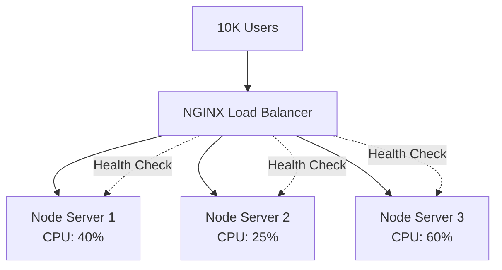
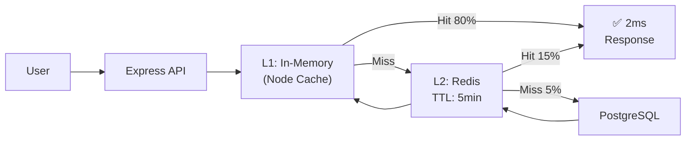
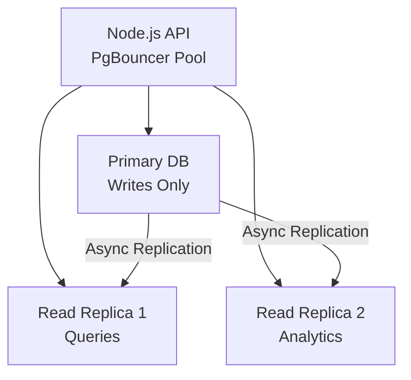
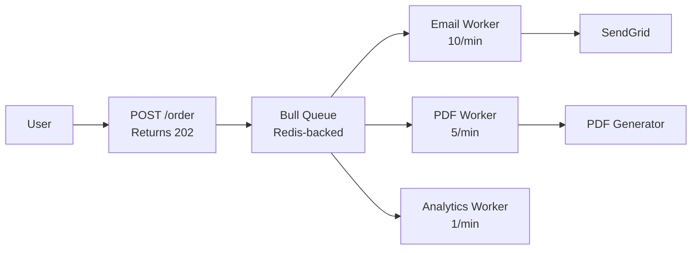
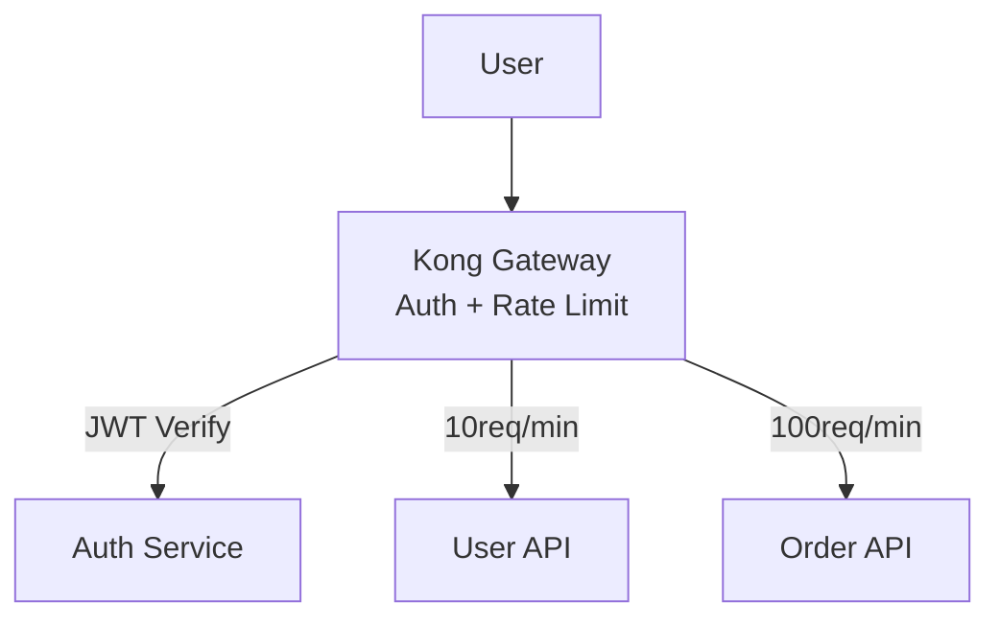
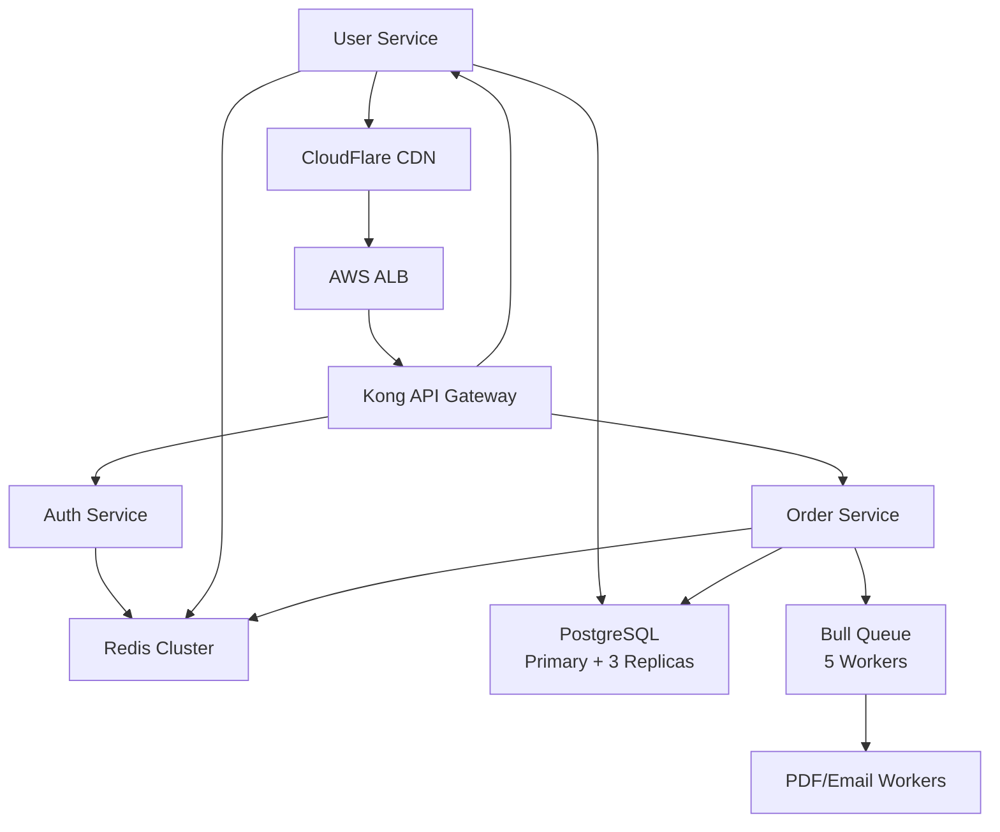

# 🚀 Backend Scalability Guide: From Simple App to Production System

**Transform your basic Node.js/Express app into a battle-tested, production-ready system handling 1M+ users**

This guide covers **every layer** of backend scaling with **real code examples**, **architecture diagrams**, and **production battle-tested patterns**.

---

## 🧱 1. Load Balancing ⚖️

### 📌 What & Why

Distributes traffic across multiple servers to prevent overloads and ensure 99.9% uptime.

**Real Example**: Your e-commerce API gets 10k users during Black Friday sale → **one server crashes**. Load balancer saves the day.

### 🏗️ Architecture



### ⚙️ Implementation Example (NGINX)

```nginx
http {
    upstream backend_servers {
        least_conn;  # Smart routing
        server 127.0.0.1:3001 weight=3;
        server 127.0.0.1:3002 weight=2;
        server 127.0.0.1:3003;
    }
  
    server {
        listen 80;
        location / {
            proxy_pass http://backend_servers;
            health_check interval=10 fails=3 passes=2 uri=/health;
        }
    }
}
```

**Tools**: NGINX (free), AWS ALB ($20+/month), Kubernetes Ingress

---

## ⚡ 2. Caching Strategy (Redis) 🧠

### 📌 The Problem It Solves

**Without cache**: Every `/user/profile` hits database → 500ms response
**With cache**: 99% requests return in **5ms**

### 🏗️ Multi-Layer Caching Flow



### 💻 Real Node.js Implementation

```javascript
const Redis = require('ioredis');
const NodeCache = require('node-cache');

const redis = new Redis();
const localCache = new NodeCache({ stdTTL: 60 }); // 1min

app.get('/user/:id', async (req, res) => {
    const cacheKey = `user:${req.params.id}`;
  
    // L1: Super fast local cache
    let user = localCache.get(cacheKey);
    if (user) return res.json(user);
  
    // L2: Redis shared cache
    user = await redis.get(cacheKey);
    if (user) {
        localCache.set(cacheKey, user); // Warm local cache
        return res.json(JSON.parse(user));
    }
  
    // L3: Database (cold cache)
    user = await db.user.findById(req.params.id);
    await redis.setex(cacheKey, 300, JSON.stringify(user)); // 5min TTL
    localCache.set(cacheKey, user);
  
    res.json(user);
});
```

**Cache What**:

- User profiles, product listings
- JWT blacklists (`redis.sadd('jwt_blacklist', token)`)
- API rate limits (`redis.incr('rate:user:123')`)

---

## 🗄️ 3. Database Scaling Patterns 📊

### 🏗️ Read Replicas + Connection Pooling



### 💻 Node.js Read/Write Split

```javascript
const { Pool } = require('pg');
const writePool = new Pool({ connectionString: process.env.WRITE_DB_URL });
const readPool = new Pool({ connectionString: process.env.READ_DB_URL });

const getUser = async (id) => {
    const client = await readPool.connect(); // Read replica
    try {
        return await client.query('SELECT * FROM users WHERE id = $1', [id]);
    } finally {
        client.release();
    }
};

const createOrder = async (order) => {
    const client = await writePool.connect(); // Primary DB
    try {
        await client.query('BEGIN');
        await client.query('INSERT INTO orders ...');
        await client.query('COMMIT');
    } finally {
        client.release();
    }
};
```

**Pro Tips**:

Read Replicas: 80% queries → replicas
Write Scaling: Sharding by user_id % 4
Indexes: CREATE INDEX ON orders(user_id, created_at DESC)

text

---

## ⚡ 4. Async Processing (Bull Queue + Redis) 📬

### 🏗️ Architecture



### 💻 Production Code

```javascript
const Queue = require('bull');
const emailQueue = new Queue('email', process.env.REDIS_URL);

app.post('/order', async (req, res) => {
    // 1. Save order (50ms)
    await db.order.create(req.body);
  
    // 2. Queue async tasks (immediate response)
    await emailQueue.add('welcome', { 
        userId: req.user.id,
        orderId: order.id 
    }, { 
        attempts: 3, 
        backoff: 5000 
    });
  
    res.status(202).json({ orderId: order.id });
});

// Worker (separate process)
emailQueue.process(async (job) => {
    await sendWelcomeEmail(job.data.userId);
});
```

**Use Cases**: Email delivery (95% success), image processing, webhooks

---

## 🔐 5. Stateless JWT + Redis Sessions 🧩

### ❌ Anti-Pattern (Don't Do)

```javascript
// Session in server memory → Can't scale!
app.use(session({
    secret: 'keyboard cat',
    resave: false,
    saveUninitialized: true,
    // This kills horizontal scaling!
}));
```

### ✅ Production Pattern

```javascript
const jwt = require('jsonwebtoken');

// 1. Login → JWT
app.post('/login', async (req, res) => {
    const user = await authenticate(req.body);
    const token = jwt.sign({ userId: user.id }, process.env.JWT_SECRET, {
        expiresIn: '7d'
    });
  
    // 2. Blacklist on logout (Redis)
    await redis.sadd('jwt_blacklist', token);
  
    res.json({ token });
});

// 3. Middleware validates
app.use(async (req, res, next) => {
    const token = req.headers.authorization?.split(' ');
    if (!token || await redis.sismember('jwt_blacklist', token)) {
        return res.status(401).json({ error: 'Invalid token' });
    }
  
    req.user = jwt.verify(token, process.env.JWT_SECRET);
    next();
});
```

---

## 🌐 6. API Gateway (Kong/OpenResty) 🚪

**Single entry point** → Auth → Rate Limit → Route → Service



**Kong Config**:

```yaml
services:
  - name: user-service
    url: http://user:3001
    routes:
      - hosts: [api.example.com]
        paths: ["/users"]
    plugins:
      - name: jwt
      - name: rate-limiting
        config:
          minute: 10
          policy: local
```

---

## 🧱 7. Microservices with Docker Compose 🐳

### 🏗️ Production Stack

```yaml
version: '3.8'
services:
  api-gateway:
    image: kong:latest
    ports: ["80:8000"]
  
  user-service:
    build: ./services/user
    environment:
      - REDIS_URL=redis://redis:6379
      - DB_URL=postgres://user:pass@db:5432/user_db
  
  redis:
    image: redis:alpine
    command: redis-server --appendonly yes
  
  db:
    image: postgres:15
    environment:
      POSTGRES_DB: user_db
```

---

## 🚀 Complete Production Architecture



## 📈 Monitoring & Observability

```bash
# Essential tools
pm2          # Process manager
prometheus   # Metrics
grafana      # Dashboards
sentry       # Error tracking
datadog      # APM
```

---

## 🎯 Implementation Roadmap

Week 1: Load Balancer + Basic Caching
Week 2: Redis + Read Replicas
Week 3: Async Queues + Stateless JWT
Week 4: API Gateway + Docker
Week 5: Monitoring + Auto-scaling

text

> **💎 Key Insight**: Scale by **removing bottlenecks**, not just adding servers. A well-cached monolith beats a poorly-designed microservices mess.

---

**⭐ Star this repo | 👨‍💻 Fork for your projects | 📢 Share with your team**

**Ready to implement? Start with Load Balancer + Redis caching first!**
